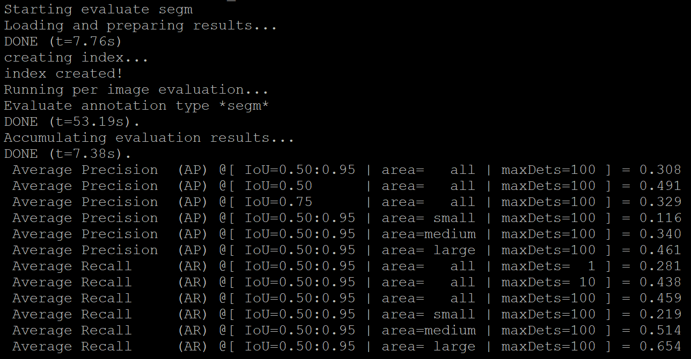

# SOLOv2
The code is an unofficial pytorch implementation of [SOLOv2: Dynamic, Faster and Stronger]
(https://arxiv.org/abs/2003.10152)

based on https://github.com/Epiphqny/SOLOv2

## Install
Please check [SOLOv1](https://github.com/WXinlong/SOLO/blob/master/docs/INSTALL.md) for installation instructions.

## Training
Follows the same way as SOLOv1.

single GPU: 
```
python tools/train.py configs/solov2/solov2_r101_3x.py
```
multi GPU (for example 8): 
```
./tools/dist_train.sh configs/solov2/solov2_r101_3x.py 8
```

## Eval
Follows the same way as SOLOv1.

single GPU: 
```
python tools/test_ins.py configs/solov2/solov2_r50_3x.py work_dirs/solo_r101_3x/latest.pth --show --out results_solo.pkl --eval segm
```

## Weights
quickly
## Results
After training 36 epochs(3x) on the coco dataset using the resnet-101 backbone, the mAP is 39.3 on COCO test-dev2017 dataset. In the original paper, the model achieves 39.7 after 72 epochs(6x).



## Visualization（1 epoch)


